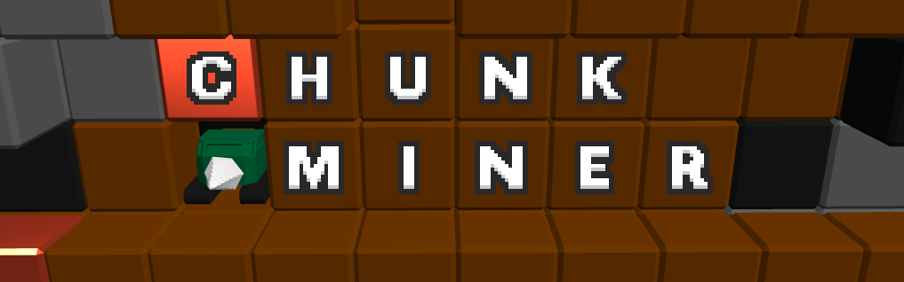

`Chunk Miner` is a small but complete game, in less than 3200 lines of code.  
It is written in [Odin](https://odin-lang.org/) with a focus on simplicity and readability.  
The finished game can be found on [itch.io](https://alektron.itch.io/) (TODO).

## Features
- 3D renderer (Direct3D 11)
- Immediate mode UI
- Camera controller
- Saving/Loading
- Minimal platform abstraction layer (Windows)
  - Window creation and event handling
  - Input
  - Timer
- Particle system
- Gameplay logic
- OBJ parser (3D file format)
- 3D clipping algorithm
- Fully arena based memory managment
- Extensive comments
- Little to no dependencies
- No cruft

## Motivation
Most games these days are made with big, general purpose game engines like Unity, Unreal or Godot.
But that is not the only way. A game does not HAVE TO rely on enormous third party codebases.
Quite the contrary. Building a game from the ground up often results in a more unique experience, better performance, more control, smaller files, independence...

Building a game from scratch can be a daunting task but a lot can be achieved with very little. With this project I want to show that it is possible to create a full game with just about 3000 lines of code.

The code is structured in a straighforward way. No unnecessary cruft, abstractions, OOP paradigms. Just what's needed to make a functioning game.

## Dependencies
`Chunk Miner` is built mostly from the ground up, with some minor exceptions.  
While it does not make use of popular libraries like [SDL](https://github.com/libsdl-org/SDL) or [raylib](https://github.com/raysan5/raylib), it uses some smaller libraries from the Odin `vendor` package as well as the Odin `core` package:
- [stb_image](https://pkg.odin-lang.org/vendor/stb/image/), a small image loading library
- [miniaudio](https://pkg.odin-lang.org/vendor/miniaudio/) for sound
- [D3D11](https://pkg.odin-lang.org/vendor/directx/d3d11/) (arguably not a 'real' dependency, since you have to use SOME graphics API to use accelerated graphics)

## Build instructions
To build `Chunk Miner` an up to date [Odin](https://odin-lang.org/) compiler must be installed.
The `build_debug.cmd` and `build_release.cmd` files can then be used to build the game.
Alternatively the command `odin.exe build ./src -debug -out:ChunkMiner.exe` can be used directly.

## What this is NOT
### A game engine
Depending on your game's requirements, team size etc. a commercial game engine might be the right choice.
Other times you might not want to rely on third party engines but instead develop your own and then build your game with that. More often than not however, your goal is not to build a game engine. But a game.

`Chunk Miner` is just that. A game. But not an engine. It does not even contain any editor or tooling.
Things like that can always be built later when they become necessary.

### A well designed game
While `Chunk Miner` contains about everything a game needs, that does not necessarily make it a good game. My main strengths are programming, not game design. In fact I know that `Chunk Miner` in it's current state is not very playable from a game design standpoint. All the mechanics are there but I never bothered to balance the values of upgrades, prices, world generation etc. enought to actually make it enjoyable.
PRs to fix that are more than welcome.

## Inspiration
- [Handmade Hero](https://mollyrocket.com/#handmade) ([Episodes](https://guide.handmadehero.org/)), an excellent video series by [Casey Muratori](https://x.com/cmuratori) on developing video games from scratch.
- [Mega Miner](https://www.newgrounds.com/portal/view/576052), an old flash game that inspired the game mechanics of `Chunk Miner`

## Credits
- The font used in `Chunk Miner` is 'Bold Blocks' from the [Nico Pixel Fonts Pack](https://emhuo.itch.io/nico-pixel-fonts-pack) 
- Original sounds (edited):
  - https://freesound.org/people/videog/sounds/149193/
  -https://freesound.org/people/kyles/sounds/637704/

